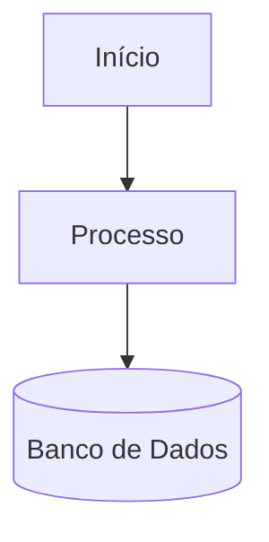
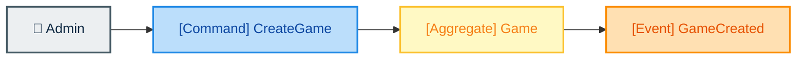
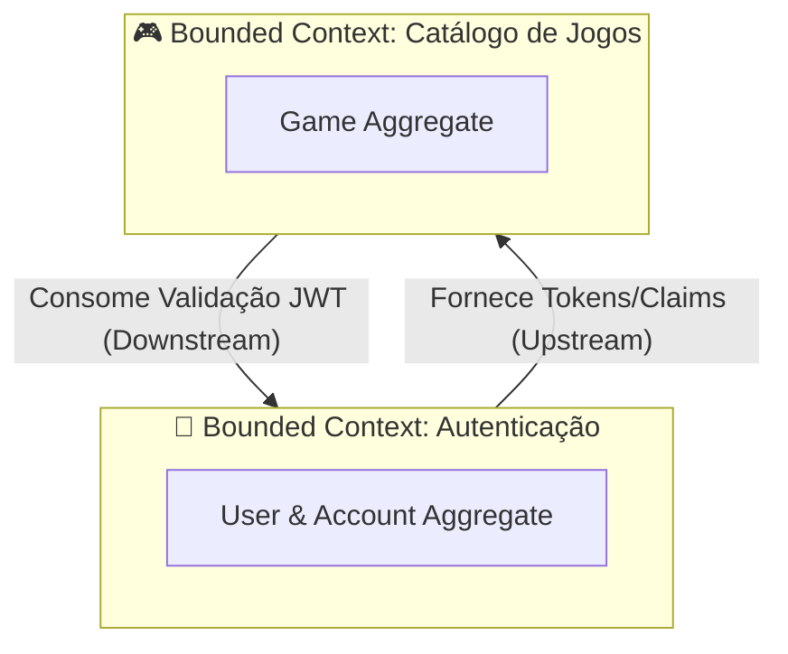

# Tutoriais e Guia de Execução

Este documento reúne roteiros de configuração de ambiente, comandos úteis da CLI do .NET, orientações para gerenciamento de banco de dados e migrações do Entity Framework Core, além de um guia prático para uso de diagramas e Event Storming com Mermaid.

---

## 📌 Sumário

1. [Roteiro para Criação do SQL Database](#roteiro-para-criação-do-sql-database)
2. [Guia Rápido de Comandos .NET CLI](#️-guia-rápido-de-comandos-net-cli)
3. [EF Core CLI e Migrations](#-ef-core-cli-e-migrations)
4. [Uso de Mermaid para Diagramas e Event Storming](#-uso-de-mermaid-para-diagramas-e-event-storming)

---

## Roteiro para Criação do SQL Database
O SQL Database é o banco de dados no Azure.

1. Criar uma conta no [Azure](https://azure.microsoft.com/pt-br) caso ainda não tenha.
2. Ative sua assinatura. Busque por **Assinaturas** (_Subscriptions_) no menu lateral. Clicar em Adicionar e seguir as instruções.
3. Agora é necessário criar um Grupo de Recursos (_Resource Group_). No menu lateral busque pela opção **Grupo de Recursos**. Clique em Criar e sigas as instruções.
4. Antes de criar o banco de dados é necessário criar um Servidor SQL Lógico (_SQL Logic Server_). No menu lateral procure por "Banco de dados SQL do Azure". Ao clicar nessa opção teremos o submenu "**Azure SQL Database > SQL Logical Servers**". Clique em criar e siga as instruções.
5. Por fim, ainda no menu "Banco de dados SQL do Azure", selecione o submenu "**Azure SQL Database > SQL Databases**". Clique em criar e siga as instruções.

Todos os recursos criados, agora basta liberar o firewall da rede virtual.
No Portal do Azure e vá até o seu Servidor SQL (o recurso de nível de servidor, e não o banco de dados isolado). No menu lateral esquerdo, clique em Rede (Firewalls and virtual networks). Na seção de regras de firewall (Firewall rules), você criará uma regra nova com os seguintes dados:  

* Nome da regra (Rule Name): PermitirTudo (ou qualquer nome de sua preferência).  
* IP Inicial (Start IP):   0.0.0.0
* IP Final (End IP): 255.255.255.255

Clique no botão Salvar (Save) na parte superior da tela.

A string de conexão está disponível no formulário de detalhes do banco de dados. Dentro desse formulário procure por "Cadeias de conexão" e escolha a que lhe atende.

---

## 🛠️ Guia Rápido de Comandos .NET CLI

Após instalar o SDK do .NET, o CLI estará disponível no seu terminal. Abaixo estão os principais comandos utilizados no ciclo de vida deste projeto:

### 1. Informações do Ambiente e Ajuda
* **`dotnet --info`**: Exibe detalhes do ambiente, SDKs e Runtimes instalados.
* **`dotnet --version`**: Mostra a versão do SDK do .NET em uso no diretório atual.
* **`dotnet --list-sdks`**: Lista todos os SDKs instalados na máquina.
* **`dotnet new list`**: Lista todos os templates de projetos disponíveis.

### 2. Criação e Gerenciamento da Solução (.sln) e Projetos (.csproj)
* **Criar uma nova solução:**
  ```bash
  dotnet new sln -n fiap-cloud-games
  ```
* **Criar o projeto Web API (Back-end):**
  ```bash
  dotnet new webapi -n fase-01 -o fase-01/back-end -f net10.0
  ```
* **Criar o projeto de Testes Unitários (xUnit):**
  ```bash
  dotnet new xunit -n fase-01.tests -o fase-01/tests
  ```
* **Adicionar projetos à solução:**
  ```bash
  dotnet sln add fase-01/back-end/fase-01.csproj
  dotnet sln add fase-01/tests/fase-01.tests.csproj
  ```
* **Listar projetos vinculados à solução:**
  ```bash
  dotnet sln list
  ```
* **Adicionar referência de um projeto em outro (dependência de projeto):**
  *(Permite que o projeto de testes acesse o projeto back-end)*
  ```bash
  dotnet add fase-01/tests/fase-01.tests.csproj reference fase-01/back-end/fase-01.csproj
  ```

### 3. Gerenciamento de Pacotes NuGet
* **Procurar pacotes no repositório NuGet:**
  ```bash
  dotnet package search <termo>
  ```
* **Adicionar pacotes ao projeto Back-end (`fase-01/back-end`):**
  ```bash
  # Autenticação JWT
  dotnet add fase-01/back-end/fase-01.csproj package Microsoft.AspNetCore.Authentication.JwtBearer

  # Documentação OpenAPI e Scalar UI (.NET 10)
  dotnet add fase-01/back-end/fase-01.csproj package Microsoft.AspNetCore.OpenApi
  dotnet add fase-01/back-end/fase-01.csproj package Scalar.AspNetCore

  # Entity Framework Core & SQL Server
  dotnet add fase-01/back-end/fase-01.csproj package Microsoft.EntityFrameworkCore.SqlServer
  dotnet add fase-01/back-end/fase-01.csproj package Microsoft.EntityFrameworkCore.Tools
  dotnet add fase-01/back-end/fase-01.csproj package Microsoft.EntityFrameworkCore.Design

  # Processamento de Imagens (Nativo)
  dotnet add fase-01/back-end/fase-01.csproj package System.Drawing.Common
  ```
* **Adicionar pacotes ao projeto de Testes (`fase-01/tests`):**
  ```bash
  dotnet add fase-01/tests/fase-01.tests.csproj package Moq
  dotnet add fase-01/tests/fase-01.tests.csproj package FluentAssertions
  ```

### 4. Compilação, Execução e Testes
* **`dotnet build`**: Compila todos os projetos da solução sem executá-los.
* **`dotnet run --project fase-01/back-end/fase-01.csproj`**: Compila e executa o projeto da Web API.
* **`dotnet watch --project fase-01/back-end/fase-01.csproj`**: Executa a API com recarregamento automático (*Hot Reload*) e abre o navegador automaticamente na documentação do Scalar (`/scalar/v1`).
* **`dotnet test`**: Executa todas as suítes de testes automatizados do projeto (modo resumido).
* **`dotnet test --logger "console;verbosity=detailed"`**: Executa os testes detalhando o nome de cada método de teste, resultado individual e tempo de execução no terminal.
* **`dotnet test --logger "console;verbosity=normal"`**: Exibe o status e o nome de cada teste de forma intermediária.
* **`dotnet test --filter "FullyQualifiedName~RegisterDtoTests"`**: Executa apenas a classe ou método de teste especificado no filtro.
* **`dotnet test --logger "trx"`**: Executa os testes e gera um relatório em arquivo `.trx` na pasta `TestResults/`.

---

## 🗄️ EF Core CLI e Migrations

Após definir as entidades no domínio e a string de conexão no `appsettings.json`, gerenciamos a evolução do banco de dados via **Entity Framework Core CLI**.

### 1. Instalar/Atualizar a Ferramenta Global do EF Core
```bash
# Instalação global do dotnet-ef
dotnet tool install --global dotnet-ef

# Atualização para a versão mais recente
dotnet tool update --global dotnet-ef
```

### 2. Comandos para Gerenciar Migrations
Navegue até o diretório do projeto Web API (`cd fase-01/back-end`) ou execute informando a flag `--project`:

* **Criar uma nova migração:**
  ```bash
  dotnet ef migrations add InitialCreate -o _02_infrastructure/data/migrations --project fase-01/back-end/fase-01.csproj
  ```
* **Aplicar as migrações no banco de dados (Azure SQL / Local):**
  ```bash
  dotnet ef database update --project fase-01/back-end/fase-01.csproj
  ```
* **Remover a última migração ainda não aplicada:**
  ```bash
  dotnet ef migrations remove --project fase-01/back-end/fase-01.csproj
  ```

---

## 🧜‍♂️ Uso de Mermaid para Diagramas e Event Storming

O **Mermaid** é uma ferramenta baseada em Markdown para geração dinâmica de diagramas e gráficos. Toda a documentação deste repositório foi projetada para ser renderizada e visualizada diretamente via **Obsidian**, **VS Code** ou **GitHub**.

📖 Para consultar a documentação completa, todos os tipos de diagramas e recursos avançados, acesse a **[Documentação Oficial do Mermaid](https://mermaid.js.org/)**.

---

### 1. Estrutura Básica

Para criar um diagrama Mermaid em um arquivo Markdown, utilize um bloco de código cercado por três crases com o identificador `mermaid`:

````markdown

````

#### 📖 Entendendo a Sintaxe:

- **Tipos de Diagramas no Mermaid**:
  - `graph` e `flowchart`: Ambos constroem **fluxogramas / grafos**. A diferença principal é que o `flowchart` é a versão mais moderna e flexível no Mermaid, suportando conexões mais complexas, estilizações avançadas de subgrafos, links interativos e curvas de linhas aprimoradas.
  - `sequenceDiagram`: Utilizado para **diagramas de sequência** (troca de mensagens ordenada ao longo do tempo entre participantes/serviços).
  - `classDiagram`: Utilizado para **diagramas de classe** (UML), mostrando propriedades, métodos, herança e associações de PHO/POCO.
  - `erDiagram`: Utilizado para **diagramas de entidade-relacionamento (DER)** de banco de dados.
  - `stateDiagram-v2`: Utilizado para **diagramas de máquinas de estado**.
  - `gantt`: Utilizado para cronogramas e gráficos de planejamento de projetos.

- **Orientação do Grafo (`graph TD` ou `flowchart LR`)**: Define a direção do fluxo visual.
  - `TD` ou `TB` (*Top-Down* / *Top-Bottom*): De cima para baixo.
  - `LR` (*Left-Right*): Da esquerda para a direita.
  - `BT` (*Bottom-Top*): De baixo para cima.
  - `RL` (*Right-Left*): Da direita para a esquerda.

- **Identificadores de Nós (`A`, `B`, `C`)**: São os IDs únicos dos elementos no código. Servem para criar conexões sem repetir o nome do nó.

- **Formatos de Nós (Símbolos e Conectores)**:
  - **Colchetes `[Texto]`**: Cria um retângulo padrão com texto dentro (ex: `A[Início]`).
  - **Parênteses `(Texto)`**: Cria um retângulo de bordas arredondadas.
  - **Cilindro com Parênteses e Colchetes `[(Texto)]`**: Representa um banco de dados / armazenamento de dados (ex: `C[(Banco de Dados)]`).
  - **Chaves `{Texto}`**: Representa um nó de decisão (losango).
  - **Parênteses duplos `((Texto))`**: Cria um nó circular.

- **Seta de Conexão e Linhas**:
  - `-->`: Seta sólida padrão.
  - `---`: Linha sem seta.
  - `-.->`: Seta pontilhada/tracejada.
  - `==>`: Seta destacada (linha grossa).
  - `-- Texto -->`: Seta com rótulo descritivo na conexão.

#### 📊 Resultado Visual Gerado:


---

### 2. Event Storming com Mermaid (Padrão DDD)

No Domain-Driven Design (DDD), o **Event Storming** utiliza post-its coloridos para mapear eventos de domínio, comandos e agregados. Podemos simular essas cores com estilos CSS (`classDef`) no Mermaid:

- 🟧 **Domain Event** (Laranja): Eventos passados relevantes para o negócio (`#ffe0b2`).
- 🟦 **Command** (Azul): Intenção ou ação iniciada por usuário/sistema (`#bbdefb`).
- 🟨 **Aggregate / Entity** (Amarelo): Entidade que garante as regras de negócio (`#fff9c4`).
- 👤 **Actor / User** (Cinza): Papel que dispara o comando (`#eceff1`).

#### Exemplo de Código Mermaid:

````markdown

````

#### 📊 Resultado Visual Gerado:


---

### 3. Diagrama de Contexto (Context Map)

O **Mapa de Contexto** mapeia os *Bounded Contexts* (Contextos Delimitados) e o relacionamento entre eles (ex: *Upstream/Downstream*, *Customer-Supplier*):

````markdown

````

#### 📊 Resultado Visual Gerado:


