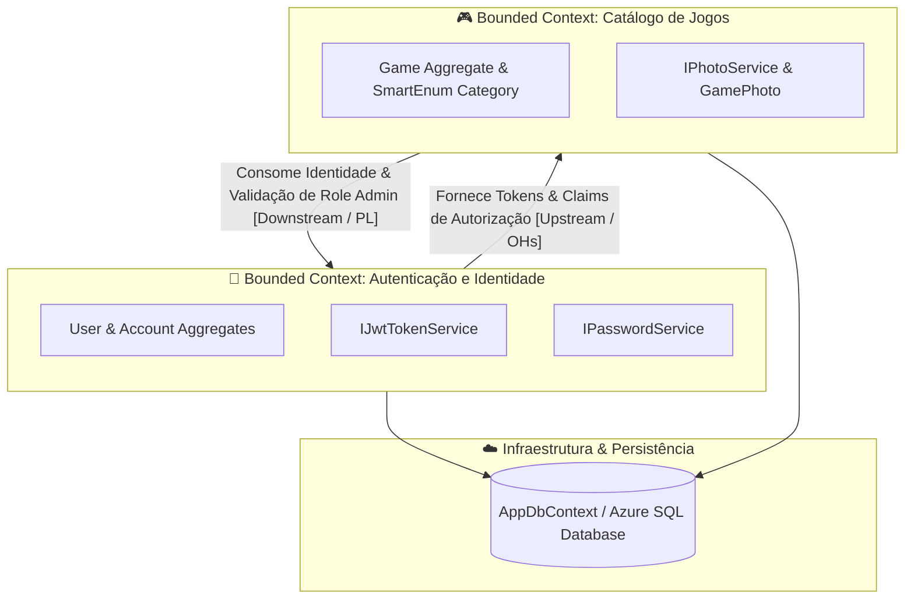

# 00. Modelagem DDD (Event Storming & Diagrama de Contexto)

#ddd #event-storming #context-map #domain #architecture #obsidian #mermaid

Voltar para a [[index|Visão Geral]] | Ver próximo: [[01-scripts-banco-dados|01. Scripts de Banco de Dados]]

---

## 🎯 Objetivo da Modelagem DDD

No contexto do **Domain-Driven Design (DDD)**, o entendimento do domínio e das regras de negócio precede a implementação técnica e o modelo de persistência. 

Neste módulo, estão documentados os artefatos de modelagem da **Fase 1**:
1. **Event Storming**: Mapeamento comportamental e temporal dos eventos de domínio, comandos, agregados e atores para os fluxos de **Usuários** e **Jogos**.
2. **Diagrama de Contexto (Context Map)**: Mapeamento dos **Bounded Contexts** (Contextos Delimitados) da aplicação e os relacionamentos entre eles.

Toda a modelagem foi construída utilizando sintaxe **Mermaid**, permitindo navegação, visualização interativa e suporte nativo no **Obsidian** e **GitHub**.

---

## 🟧 Event Storming dos Fluxos de Negócio

No Event Storming, utilizamos a convenção visual de cores padronizada do DDD:

- 👤 **Actor / Usuário** (Cinza - `#eceff1`): Papel humano ou sistema cliente que dispara uma intenção.
- 🟦 **Command** (Azul - `#bbdefb`): Ação ou intenção solicitada ao sistema.
- 🟨 **Aggregate / Entidade** (Amarelo - `#fff9c4`): Unidade de regra de negócio e consistência de dados.
- 🟧 **Domain Event** (Laranja - `#ffe0b2`): Ocorrência relevante no passado do domínio (verbo no particípio/passado).

---

### 1. Event Storming: Fluxo de Criação e Autenticação de Usuários

Este fluxo abrange desde o registro de um novo usuário visitante até o hash de senhas, criação de conta e geração do token JWT.

```mermaid
flowchart LR
    %% Definição de Cores do Event Storming
    classDef actor fill:#eceff1,stroke:#455a64,color:#102a43,stroke-width:2px;
    classDef command fill:#bbdefb,stroke:#1e88e5,color:#0d47a1,stroke-width:2px;
    classDef aggregate fill:#fff9c4,stroke:#fbc02d,color:#f57f17,stroke-width:2px;
    classDef event fill:#ffe0b2,stroke:#fb8c00,color:#e65100,stroke-width:2px;

    %% Atores
    Visitor[👤 Visitante]:::actor
    UserSystem[👤 Usuário Cadastrado]:::actor

    %% Sub-fluxo 1: Registro
    Visitor --> C_Register["[Command] RegisterUser"]:::command
    C_Register --> A_User["[Aggregate] User / Account"]:::aggregate
    A_User --> E_UserCreated["[Event] UserRegistered"]:::event
    E_UserCreated --> C_Hash["[Command] HashPassword"]:::command
    C_Hash --> E_PasswordHashed["[Event] PasswordHashedAndSaved"]:::event

    %% Sub-fluxo 2: Login e Autenticação
    UserSystem --> C_Login["[Command] AuthenticateUser"]:::command
    C_Login --> A_Account["[Aggregate] Account"]:::aggregate
    A_Account --> E_Auth["[Event] UserAuthenticated"]:::event
    E_Auth --> C_Jwt["[Command] GenerateJwtToken"]:::command
    C_Jwt --> E_TokenIssued["[Event] JwtTokenIssued"]:::event
```

#### 📌 Detalhamento dos Componentes do Fluxo:
- **Comandos**: `RegisterUser` (Solicita cadastro com nome, nickname, e-mail e senha), `AuthenticateUser` (Solicita login com e-mail e senha).
- **Agregados**: `User` e `Account` garantem a unicidade do e-mail, formato válido e integridade do hash PBKDF2/HMAC-SHA512.
- **Eventos de Domínio**: `UserRegistered`, `PasswordHashedAndSaved`, `UserAuthenticated`, `JwtTokenIssued`.

---

### 2. Event Storming: Fluxo de Criação e Gerenciamento de Jogos

Este fluxo contempla o cadastro de jogos no catálogo por administradores, validação de categorias (*Smart Enum*) e upload/redimensionamento da foto de capa.

```mermaid
flowchart LR
    %% Definição de Cores do Event Storming
    classDef actor fill:#eceff1,stroke:#455a64,color:#102a43,stroke-width:2px;
    classDef command fill:#bbdefb,stroke:#1e88e5,color:#0d47a1,stroke-width:2px;
    classDef aggregate fill:#fff9c4,stroke:#fbc02d,color:#f57f17,stroke-width:2px;
    classDef event fill:#ffe0b2,stroke:#fb8c00,color:#e65100,stroke-width:2px;

    %% Atores
    Admin[👤 Administrador]:::actor

    %% Fluxo de Cadastro e Mídia de Jogos
    Admin --> C_CreateGame["[Command] CreateGame"]:::command
    C_CreateGame --> A_Game["[Aggregate] Game / SmartEnum Category"]:::aggregate
    A_Game --> E_GameCreated["[Event] GameCreated"]:::event

    E_GameCreated --> C_UploadPhoto["[Command] UploadGamePhoto"]:::command
    C_UploadPhoto --> A_Photo["[Aggregate] GamePhoto / PhotoService"]:::aggregate
    A_Photo --> E_PhotoProcessed["[Event] PhotoResizedAndSaved"]:::event
```

#### 📌 Detalhamento dos Componentes do Fluxo:
- **Comandos**: `CreateGame` (Informa título, fabricante, descrição, modo online/multiplayer e categoria), `UploadGamePhoto` (Envia arquivo de imagem de capa).
- **Agregados**: `Game` (valida obrigatoriedade de campos e conversão da categoria via `GameCategory` Smart Enum) e `GamePhoto` (processa e armazena imagem e miniatura).
- **Eventos de Domínio**: `GameCreated`, `PhotoResizedAndSaved`.

---

## 🗺️ Diagrama de Contexto (Context Map)

O **Mapa de Contexto** estabelece os limites explícitos de cada **Bounded Context** (Contexto Delimitado) da solução e define a forma como eles se comunicam.

### 📖 Padrões de Relacionamento Entre os Contextos:

1. **Contexto de Autenticação e Identidade (`Boundary_Auth`)**:
   - Actua como **Upstream (U)** e fornece um serviço de protocolo aberto (*Open Host Service / OHS*) baseado em **JWT Tokens**.
   - Responsável pelo ciclo de vida do usuário, segurança de credenciais e emissão das *claims* (ex: `Role = Admin`).

2. **Contexto de Catálogo de Jogos (`Boundary_Catalog`)**:
   - Atua como **Downstream (D)** através de uma *Conformist / Published Language (PL)*, consumindo os tokens JWT emitidos para proteger endpoints de escrita (cadastros e uploads de foto).
   - Mantém autonomia nas regras de negócio de jogos e categorias, dependendo da autenticação apenas para autorização de acesso.

3. **Camada de Persistência Compartilhada (`Infrastructure`)**:
   - Mapeada via Entity Framework Core (`AppDbContext`), isolando os modelos relacionais das regras de negócio ricas do domínio.
