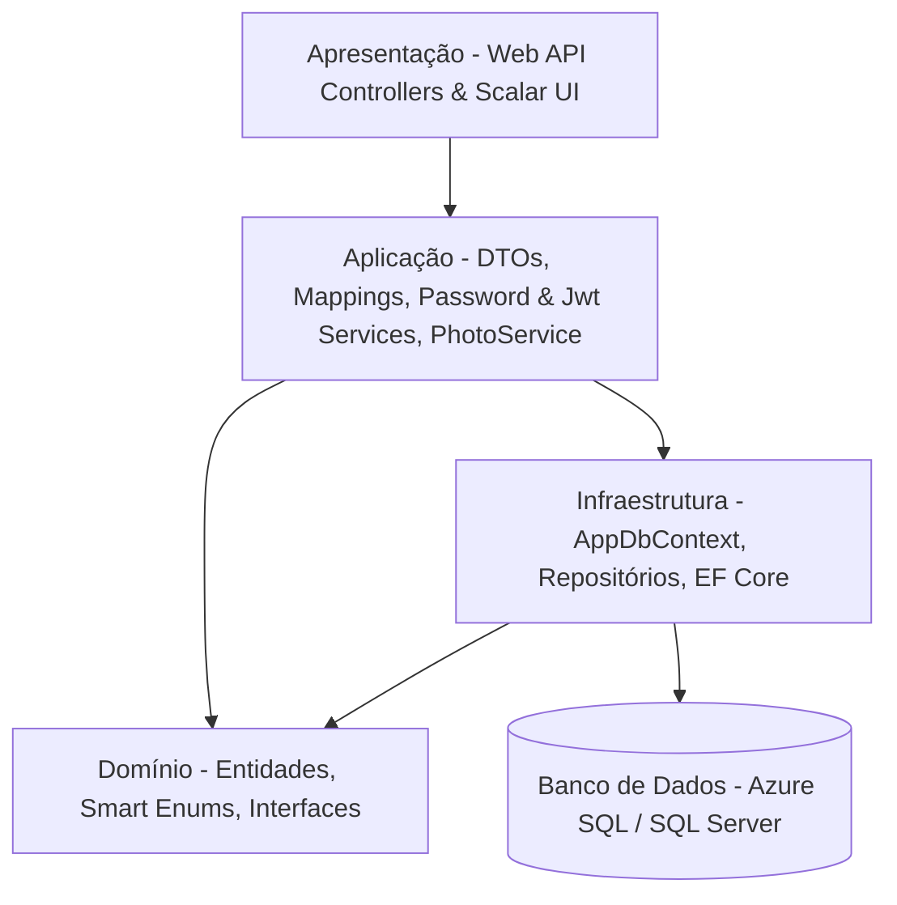

# FIAP Cloud Games - Documentação da Fase 1

#arquitetura #dotnet #webapi #rest #jwt #openapi #scalar #efcore #obsidian #fiap

Bem-vindo à documentação técnica do projeto **FIAP Cloud Games (Fase 1)**. Este repositório de documentos foi estruturado para ser lido e navegado de forma fluida no **Obsidian**, utilizando links internos e organização por camadas de software.

---

## 📌 Sumário da Documentação

Abaixo estão os módulos documentados em ordem cronológica de desenvolvimento. Siga este fluxo para entender ou reproduzir o projeto do zero:

0. [Modelagem DDD (Event Storming & Diagrama de Contexto)](00-modelagem-ddd-event-storming.md)
   - Event Storming dos fluxos de criação e autenticação de usuários e cadastro de jogos em Mermaid.
   - Diagrama de Contexto (*Context Map*) detalhando os Bounded Contexts da aplicação.
1. [Scripts e Estrutura de Banco de Dados](01-scripts-banco-dados.md)
   - Criação de tabelas relacionais em SQL Server / Azure SQL (`Users`, `Accounts`, `UsersPhotos`, `Games`, `EnumGamesCategories`, `GamesPhotos`).
   - Script de carga e povoamento inicial de jogos (*seed data*).
2. [Camada de Domínio (Domain Layer)](02-camada-dominio.md)
   - Entidades de Domínio (`Game`, `User`, `Account`, `GamePhoto`, `UserPhoto`).
   - Padrão *Smart Enum* para Categorias (`GameCategory`).
   - Contratos e Interfaces de Repositório (`IRepositoryBase`, `IGameRepository`, `IUserRepository`, etc.).
3. [Camada de Infraestrutura (Infrastructure Layer)](03-camada-infraestrutura.md)
   - Configuração do Entity Framework Core (`AppDbContext`).
   - Mapeamento Fluent API, Check Constraints e Cascading Deletes.
   - Implementação do Padrão *Repository* Genérico e Específico (`UserRepository` com autenticação).
   - Migrations do EF Core e Resiliência com Azure SQL (`EnableRetryOnFailure`).
4. [Camada de Aplicação (Application Layer)](04-camada-aplicacao.md)
   - DTOs (`GameDto`, `UserDto`, `RegisterDto`, `LoginDto` e `JwtSettingsDto`) com suporte a recebimento de foto em formato Base64.
   - Mapeamento bidirecional via Métodos de Extensão C# (`ToDto` e `ToEntity`).
   - Serviços de Autenticação e Segurança (`IPasswordService`, `IJwtTokenService`).
   - Serviço de Processamento de Imagens em Base64, Miniaturas com `System.Drawing.Common` e exclusão de mídia (`PhotoService`).
5. [Camada de Apresentação (Presentation Layer - Web API)](05-camada-apresentacao.md)
   - Controllers RESTful (`AccountController`, `GameController`, `UserController`).
   - Autenticação e Autorização via JWT Bearer Token (`[Authorize]`, `[Authorize(Roles = "Admin")]`).
   - Endpoints ajustados para recebimento de requisições `application/json` (`[FromBody]`) contendo foto em Base64 (`PhotoBase64`).
   - Endpoints dedicados para exclusão de fotos de usuários (`DELETE /api/user/photo/{id}`) e jogos (`DELETE /api/game/photo/{id}`).
   - Regras de segurança em `UserController`: acesso restrito a dados do próprio usuário ou admin em `GetById`, e proteção contra remoção/exclusão do único administrador em `Update` e `Delete`.
   - Documentação Interativa com OpenAPI Nativo (`Microsoft.AspNetCore.OpenApi`) e Scalar UI (`Scalar.AspNetCore`).
   - Endpoints de streaming de mídia e respostas padronizadas em JSON.
6. [Roteiro de Testes Manuais via Scalar UI](06-roteiro-testes-scalar.md)
   - Guia passo a passo para execução manual de requisições HTTP na interface interativa do Scalar (`/scalar/v1`).
   - Exemplos práticos em JSON com foto em Base64 válida para registro, criação e alteração.
   - Validação prática de atribuição do 1º administrador, autenticação JWT, exclusão de fotos de usuários e jogos, permissões de perfil, regras do último admin, scraping de fotos e tratamento de exceções.
7. **Suíte de Testes Automatizados (`fase-01/tests`)**
   - Testes unitários com **xUnit**, **Moq** e **FluentAssertions**.
   - Organização estruturada (`UnitTests` e `IntegrationTests`).
   - Cobertura de validações de DTOs, regras de complexidade de senhas, serviços e controladores.

---

## 🏗️ Arquitetura e Visão Geral da Solução

O projeto adota uma **Arquitetura em Camadas (Layered Architecture)** com separação clara de responsabilidades voltada a uma **Web API RESTful**:



### 🛠️ Tecnologias e Bibliotecas Utilizadas
- **Linguagem & Framework:** .NET 10 / C# 13 (ASP.NET Core Web API)
- **Segurança & Autenticação:** JWT (JSON Web Tokens) via `Microsoft.AspNetCore.Authentication.JwtBearer`
- **Hash de Senhas:** PBKDF2 / HMAC-SHA512 via `PasswordHasher<User>`
- **ORM:** Entity Framework Core 10 (SQL Server Provider)
- **Banco de Dados:** Azure SQL Database / SQL Server Express
- **Documentação de API:** OpenAPI Nativo (`Microsoft.AspNetCore.OpenApi`) + Scalar API Reference (`Scalar.AspNetCore`)
- **Processamento de Imagens:** `System.Drawing.Common`
- **Testes Automatizados:** xUnit 2.9, Moq 4.20, FluentAssertions 8.10

---

## 🚀 Guia Rápido de Reprodução da Aplicação

Caso precise recriar este projeto do zero em um novo ambiente:

### 1. Clonar / Inicializar o Projeto
```bash
dotnet new webapi -n fase-01 -f net10.0
cd fase-01
```

### 2. Instalar Pacotes NuGet
```bash
dotnet add package Microsoft.AspNetCore.Authentication.JwtBearer
dotnet add package Microsoft.AspNetCore.OpenApi
dotnet add package Microsoft.EntityFrameworkCore.SqlServer
dotnet add package Microsoft.EntityFrameworkCore.Tools
dotnet add package Scalar.AspNetCore
dotnet add package System.Drawing.Common
```

### 3. Executar Migrations e Atualizar o Banco
Garanta que a connection string `DefaultConnection` e o bloco `JwtSettings` estejam configurados no `appsettings.json`.
```bash
dotnet ef migrations add InitialCreate
dotnet ef database update
```

### 4. Compilar, Rodar e Testar
```bash
# Compilar e rodar a API (com Hot Reload)
dotnet watch --project fase-01/back-end/fase-01.csproj

# Executar suíte de testes unitários com output detalhado dos métodos
dotnet test --logger "console;verbosity=detailed"
```
Acesse a documentação interativa do **Scalar** em `http://localhost:5030/scalar/v1` (ou porta configurada) no seu navegador.
