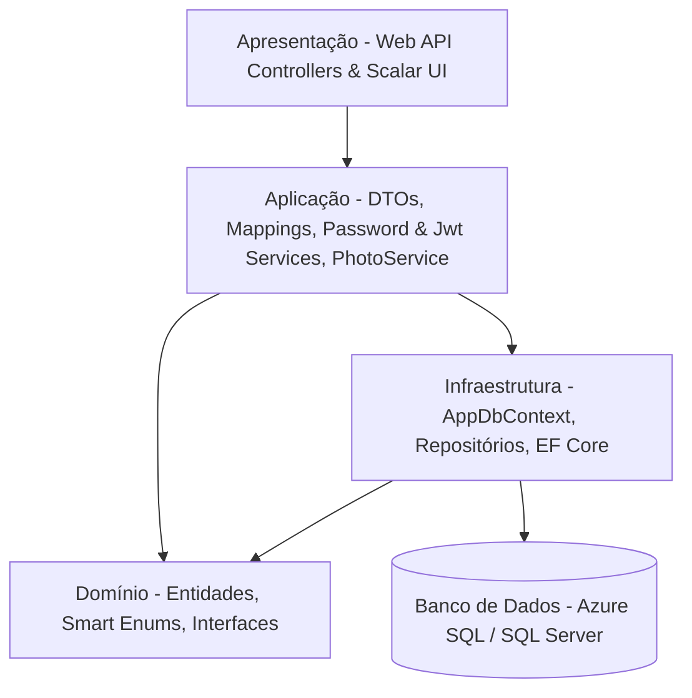

# FIAP Cloud Games - Documentação da Fase 1

#arquitetura #dotnet #webapi #rest #jwt #openapi #scalar #efcore #obsidian #fiap

Bem-vindo à documentação técnica do projeto **FIAP Cloud Games (Fase 1)**. Este repositório de documentos foi estruturado para ser lido e navegado de forma fluida no **Obsidian**, utilizando links internos e organização por camadas de software.

---

## 📌 Sumário da Documentação

Abaixo estão os módulos documentados em ordem cronológica de desenvolvimento. Siga este fluxo para entender ou reproduzir o projeto do zero:

1. [[01-scripts-banco-dados|01. Scripts e Estrutura de Banco de Dados]]
   - Criação de tabelas relacionais em SQL Server / Azure SQL (`Users`, `Accounts`, `UsersPhotos`, `Games`, `EnumGamesCategories`, `GamesPhotos`).
   - Script de carga e povoamento inicial de jogos (*seed data*).
2. [[02-camada-dominio|02. Camada de Domínio (Domain Layer)]]
   - Entidades de Domínio (`Game`, `User`, `Account`, `GamePhoto`, `UserPhoto`).
   - Padrão *Smart Enum* para Categorias (`GameCategory`).
   - Contratos e Interfaces de Repositório (`IRepositoryBase`, `IGameRepository`, `IUserRepository`, etc.).
3. [[03-camada-infraestrutura|03. Camada de Infraestrutura (Infrastructure Layer)]]
   - Configuração do Entity Framework Core (`AppDbContext`).
   - Mapeamento Fluent API, Check Constraints e Cascading Deletes.
   - Implementação do Padrão *Repository* Genérico e Específico (`UserRepository` com autenticação).
   - Migrations do EF Core e Resiliência com Azure SQL (`EnableRetryOnFailure`).
4. [[04-camada-aplicacao|04. Camada de Aplicação (Application Layer)]]
   - DTOs (Data Transfer Objects), `RegisterDto`, `LoginDto` e `JwtSettingsDto`.
   - Mapeamento bidirecional via Métodos de Extensão C# (`ToDto` e `ToEntity`).
   - Serviços de Autenticação e Segurança (`IPasswordService`, `IJwtTokenService`).
   - Serviço de Processamento de Imagens e Miniaturas com SixLabors.ImageSharp (`PhotoService`).
5. [[05-camada-apresentacao|05. Camada de Apresentação (Presentation Layer - Web API)]]
   - Controllers RESTful (`AccountController`, `GameController`, `UserController`).
   - Autenticação e Autorização via JWT Bearer Token (`[Authorize]`, `[Authorize(Roles = "Admin")]`).
   - Documentação Interativa com OpenAPI Nativo (`Microsoft.AspNetCore.OpenApi`) e Scalar UI (`Scalar.AspNetCore`).
   - Endpoints de streaming de mídia e respostas padronizadas em JSON.

---

## 🏗️ Arquitetura e Visão Geral da Solução

O projeto adota uma **Arquitetura em Camadas (Layered Architecture)** com separação clara de responsabilidades voltada a uma **Web API RESTful**:



### 🛠️ Tecnologias e Bibliotecas Utilizadas
- **Linguagem & Framework:** .NET 10 / C# 13 (ASP.NET Core Web API)
- **Segurança & Autenticação:** JWT (JSON Web Tokens) via `Microsoft.AspNetCore.Authentication.JwtBearer`
- **Hash de Senhas:** PBKDF2 / HMAC-SHA512 via `PasswordHasher<User>`
- **ORM:** Entity Framework Core 10 (SQL Server Provider)
- **Banco de Dados:** Azure SQL Database / SQL Server Express
- **Documentação de API:** OpenAPI Nativo (`Microsoft.AspNetCore.OpenApi`) + Scalar API Reference (`Scalar.AspNetCore`)
- **Processamento de Imagens:** `SixLabors.ImageSharp` (versão 4.x)

---

## 🚀 Guia Rápido de Reprodução da Aplicação

Caso precise recriar este projeto do zero em um novo ambiente:

### 1. Clonar / Inicializar o Projeto
```bash
dotnet new webapi -n fase-01 -f net10.0
cd fase-01
```

### 2. Instalar Pacotes NuGet
```bash
dotnet add package Microsoft.AspNetCore.Authentication.JwtBearer
dotnet add package Microsoft.AspNetCore.OpenApi
dotnet add package Microsoft.EntityFrameworkCore.SqlServer
dotnet add package Microsoft.EntityFrameworkCore.Tools
dotnet add package Scalar.AspNetCore
dotnet add package SixLabors.ImageSharp
```

### 3. Executar Migrations e Atualizar o Banco
Ganta que a connection string `DefaultConnection` e o bloco `JwtSettings` estão configurados no `appsettings.json`.
```bash
dotnet ef migrations add InitialCreate
dotnet ef database update
```

### 4. Compilar e Rodar
```bash
dotnet run
# ou para recarregamento automático e abertura do navegador:
dotnet watch
```
Acesse a documentação interativa do **Scalar** em `https://localhost:7094/scalar/v1` (ou porta configurada) no seu navegador.
